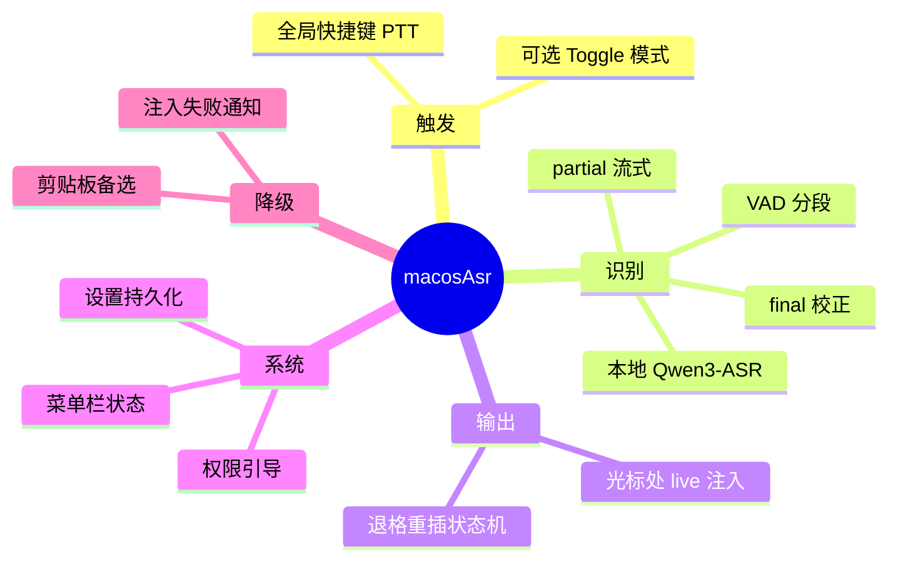
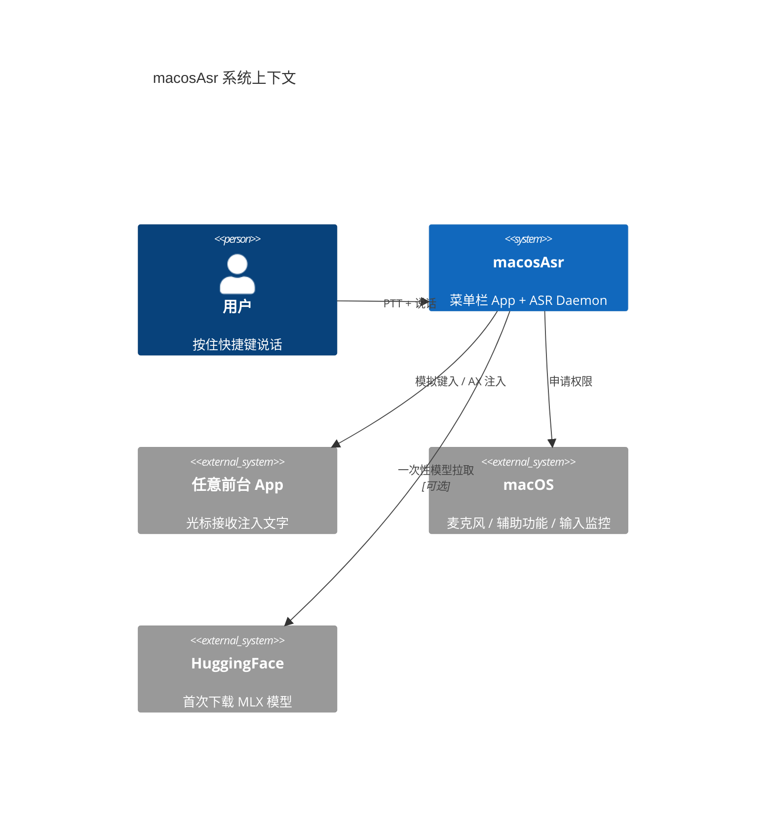
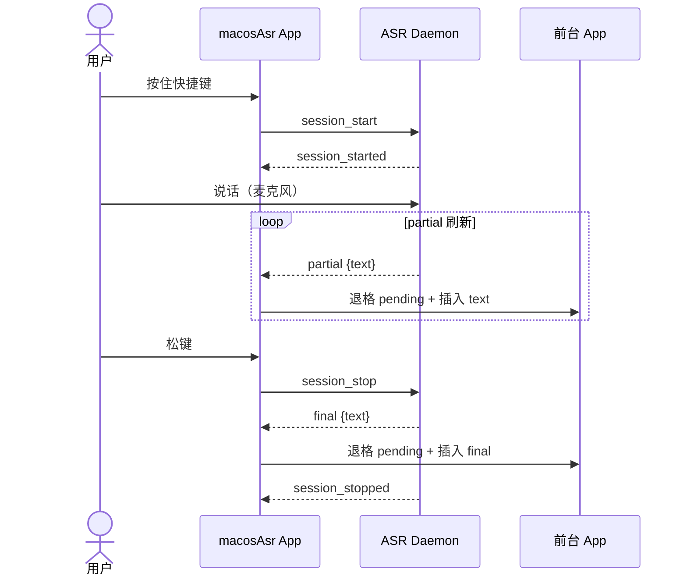
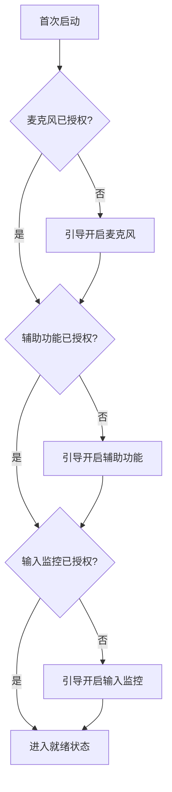

# 01 — 需求规格说明书（SRS）

**项目名称**：macosAsr  
**版本**：Draft v0.1.2  
**日期**：2026-05-21  
**目标平台**：macOS（Apple Silicon，Mac mini M4 16GB 为参考环境）

---

## 1. 引言

### 1.1 目的

定义 macosAsr 的功能需求、非功能需求、系统约束与验收标准，作为设计、开发、测试的唯一基线。

### 1.2 范围

macosAsr 是一款 **macOS 菜单栏常驻** 的本地语音输入工具。当前可直接试用的入口是菜单栏 **Start Live Dictation / Stop Live Dictation**；后续版本再引入全局快捷键，在 **任意前台应用** 的光标位置进行 **边说边出字（live partial）** 的语音听写。

**范围内**：

- 本地 Qwen3-ASR 语音识别（基于 ASR-QWEN 复制并精简的代码）
- 菜单栏 Start/Stop 触发（当前实现）
- 全局快捷键触发（后续版本，PTT / Fn+V 候选）
- 流式 partial + 句末 final 写入光标
- 麦克风 / 辅助功能 / 输入监控权限引导

**范围外（v1 不做）**：

- 云端 ASR
- LLM 后处理 / 语音命令 / 多轮对话
- App Store 分发与公证（MVP 阶段）
- Windows / Linux

### 1.3 定义与缩写

见 [README](./README.md) 术语表。

### 1.4 参考

- ASR-QWEN 项目：`/Users/jackwl/Code/ASR-QWEN`（代码将 **复制并精简** 至 macosAsr，不运行时依赖外部路径）
- ASR-QWEN `README_ZH.md`：Qwen3-ASR + partial-first 能力说明

---

## 2. 总体描述

### 2.1 产品背景

用户在 Mac 上写作、聊天、写代码注释时，希望用 **本地、低延迟、隐私安全** 的语音输入替代打字，体验接近 iOS 听写：**说话过程中文字逐词出现在光标处**。

### 2.2 用户特征

| 角色 | 描述 |
|------|------|
| 主要用户 | 个人开发者 / 知识工作者，使用 Mac mini M4，接受手动授予系统权限 |
| 技能 | 能安装 `.app`、在系统设置中开启辅助功能，无需命令行日常使用 |

### 2.3 运行环境

| 项 | 要求 |
|----|------|
| 硬件 | Apple Silicon Mac（M4 16GB 为基准） |
| 系统 | **macOS 15.0+**（开发与验收基准机：**15.3.1**） |
| 依赖 | Python 3 + venv **位于 macosAsr 项目内**；PortAudio（`brew install portaudio`） |
| 网络 | 仅首次下载 MLX 模型时需要；日常使用可离线 |

### 2.4 约束

1. **ASR 代码**：从 ASR-QWEN **复制并精简** 进 `macosAsr/asr/`，运行时 **不依赖** 外部 ASR-QWEN 路径。
2. **开源**：macosAsr 计划开源；`NOTICE` 仅作 **ASR-QWEN 代码来源致谢**（不要求单独追踪 ASR-QWEN 的 LICENSE 文件）。
3. **架构**：Swift 原生壳（热键、注入、UI）+ Python Daemon（ASR），双进程。
4. **开发方式**：SDD — 本文档评审通过后方可编码。

---

## 3. 功能需求

### 3.1 需求总览

### 3.2 FR-001 全局快捷键听写

| 属性 | 说明 |
|------|------|
| 优先级 | P0 |
| 描述 | 当前版本通过菜单栏 Start/Stop 触发听写；后续版本用户可配置全局快捷键，**PTT（按住说话，松键结束）** 为候选 |
| 输入 | 键盘全局事件 |
| 输出 | 进入/退出听写 Session |
| 规则 | 菜单触发不依赖输入监控；后续快捷键方案需「输入监控」权限，且不得与系统/本机常用组合冲突；冲突时设置页提示并引导重选 |

**验收**：

- 在备忘录中通过菜单栏 Start/Stop 能开始和结束会话
- 后续快捷键方案在未授权输入监控时，有明确引导而非 silent fail

### 3.3 FR-002 Live Partial 写入光标

| 属性 | 说明 |
|------|------|
| 优先级 | P0 |
| 描述 | 说话过程中，partial 文本 **实时出现在当前前台 App 光标处** |
| 规则 | 采用「退格 N + 插入新 partial」状态机；维护 `pending_len` |
| 频率 | partial 刷新间隔目标 0.25–0.30s（可配置） |

**验收**：

- 用户朗读「你好世界」，在首个 partial 出现后能观察到文字随说话更新
- 句末 final 与 partial 不一致时，光标处最终显示 final 文本

### 3.4 FR-003 句末 Final 校正

| 属性 | 说明 |
|------|------|
| 优先级 | P0 |
| 描述 | VAD 句末或 PTT 松键时，调用 `generate()` 输出 final，替换当前 pending 文本 |
| 规则 | 过滤 filler（嗯/啊等）时发送 `filtered` 事件，不注入 |

### 3.5 FR-004 ASR Daemon 常驻

| 属性 | 说明 |
|------|------|
| 优先级 | P0 |
| 描述 | App 启动时拉起 Python Daemon，**模型只加载一次** |
| 规则 | 噪声校准在 Daemon 首次启动执行；后续 Session 复用阈值 |
| IPC | Unix Domain Socket + JSON Lines |

### 3.6 FR-005 菜单栏与 Session 状态

| 属性 | 说明 |
|------|------|
| 优先级 | P1 |
| 描述 | Menu Bar 图标反映：空闲 / 听写中 / 错误 |
| 规则 | 听写中可选 HUD 提示「请勿编辑」 |

### 3.7 FR-006 设置

| 属性 | 说明 |
|------|------|
| 优先级 | P1 |
| 描述 | 可配置项见 PRD；设置持久化至 `~/Library/Application Support/macosAsr/` |

| 设置项 | 默认值 |
|--------|--------|
| 触发方式 | 当前版本：菜单栏 Start/Stop；后续版本：PTT / Toggle |
| 快捷键 | 后续版本推荐 `Fn + V` 按住（PTT）；当前版本不暴露 |
| 语言 | Chinese |
| 模型 | `Qwen3-ASR-0.6B-8bit` |
| 麦克风设备 | 系统默认 |
| partial 间隔 | 0.25s |

### 3.8 FR-007 权限引导

| 属性 | 说明 |
|------|------|
| 优先级 | P1 |
| 描述 | 首次启动分步引导：麦克风 → 辅助功能 → 输入监控 |
| 规则 | 每项未授权时对应功能不可用，并给出跳转系统设置的说明 |

### 3.9 FR-008 注入失败降级

| 属性 | 说明 |
|------|------|
| 优先级 | P2 |
| 描述 | 无法向光标注入时，系统通知 + 可选复制 final 到剪贴板 |
| 规则 | 密码框、安全输入区 **不尝试注入** |

---

## 4. 非功能需求

### 4.1 性能（NFR-PERF）

| 指标 | 目标（M4 16GB，Daemon 已 warm） |
|------|----------------------------------|
| 按住快捷键 → 首 partial 出现在光标 | ≤ 2.0s（理想 ≤ 1.5s） |
| partial 刷新间隔 | 0.25–0.5s |
| final 校正（松键/句末） | ≤ 1.0s |
| Daemon 冷启动到可听 | ≤ 10s |
| 常驻内存 | ≤ 2.5GB（0.6B 模型） |
| 空闲 CPU | ≈ 0（无 Session 时） |

### 4.2 可靠性（NFR-REL）

- Daemon 崩溃后 App 自动重启 Daemon（最多 3 次/分钟，带退避）
- Session 异常结束时，清理 pending 注入状态，避免光标残留脏 partial

### 4.3 兼容性（NFR-COMPAT）

**目标**：任意 macOS App；**保证级别**分 Tier：

| Tier | 场景 | MVP 要求 |
|------|------|----------|
| A | 备忘录、TextEdit、多数原生文本框 | 必须 PASS |
| B | Cursor / VS Code / Terminal | 必须实测并文档化 |
| C | 微信 / Slack / Electron | 尽力支持，已知问题入文档 |
| D | 密码框、银行、全屏游戏 | 明确不支持 |

### 4.4 安全与隐私（NFR-SEC）

- 音频与识别 **默认不出本机**
- 不上传用户听写内容
- 日志不含完整听写正文（可配置 debug 模式）

### 4.5 可维护性（NFR-MAINT）

- ASR 模块与 App 壳解耦，IPC 协议版本化
- `asr/` 目录头部注释标注 ASR-QWEN 来源 commit

### 4.6 开源（NFR-OSS）

- 仓库含 macosAsr 自身 `LICENSE`；`NOTICE` 仅注明 ASR 代码复制来源（不依赖 ASR-QWEN LICENSE 文件）
- 不包含 ASR-QWEN 的 LLM / 对话 / 评测脚本

---

## 5. 系统上下文

---

## 6. 核心用例

### UC-01 按住说话并 live 出字

### UC-02 权限首次引导

---

## 7. 数据需求

本系统 **无中央数据库**。持久化数据：

| 数据 | 存储位置 | 内容 |
|------|----------|------|
| 用户设置 | Application Support | 快捷键、语言、模型、设备 ID |
| Daemon 日志 | `macosAsr/log/`（gitignore） | 运行日志，默认不含完整 transcript |
| MLX 模型缓存 | HuggingFace 默认缓存 | 模型权重 |

---

## 8. 验收标准（MVP）

### 8.1 P0 门禁（必须全部通过）

- [ ] Daemon 独立运行：IPC 下发 `session_start/stop`，终端/测试客户端收到 partial/final JSON 事件
- [ ] Swift 注入原型：mock partial 事件写入「备忘录」光标，退格重插逻辑正确
- [ ] 端到端：PTT + 真实 ASR，在备忘录 live 出字 + final 校正
- [ ] 权限缺失时有明确 UI 提示

### 8.2 P1 门禁

- [ ] 设置页：快捷键、语言、麦克风、PTT/Toggle
- [ ] Tier A + B App 实测矩阵通过并记录
- [ ] Daemon 崩溃自动恢复

### 8.3 P2 门禁

- [ ] 注入失败降级（通知 + 剪贴板）
- [ ] 开机自启（可选）

---

## 9. 风险与假设

| ID | 类型 | 描述 | 缓解 |
|----|------|------|------|
| R-01 | 风险 | 中文 IME 组合态导致乱序 | Session 内 HUD 提示；文档说明；可选 Esc 取消组合 |
| R-02 | 风险 | Electron App 注入不稳定 | Tier 分级 + 降级策略 |
| R-03 | 风险 | partial 延迟 >2s 影响 live 体验 | P0 先 benchmark partial-first，再写 Swift |
| A-01 | 假设 | 用户接受三类系统权限 | 首次引导 |
| A-02 | 假设 | M4 16GB 可跑 0.6B 8bit 模型 | 设置中提供 1.7B 选项 |

---

## 10. 已决事项（原 Open Questions）

| ID | 问题 | **结论** | 日期 |
|----|------|----------|------|
| OQ-01 | 最低 macOS 版本 | **macOS 15.0+**；本机基准 **15.3.1** | 2026-05-21 |
| OQ-02 | Toggle 是否进 MVP | **P1 再做**；当前 MVP 仅菜单 Start/Stop | 2026-05-21 |
| OQ-03 | 当前默认入口 | 当前版本默认入口为菜单栏 Start/Stop；若后续启用快捷键，推荐候选为 `Fn + V` 按住（PTT），fallback 见 PRD §4.2.2 | 2026-05-21 |
| OQ-04 | ASR-QWEN LICENSE | **不需要**单独追踪；`NOTICE` 仅保留来源致谢即可 | 2026-05-21 |

---

## 11. 追溯矩阵（需求 → 后续设计）

| 需求 ID | PRD 章节 | 技术设计章节 |
|---------|----------|--------------|
| FR-001 | §3 交互 | §4 热键模块 |
| FR-002 | §3 交互 | §5 注入状态机 |
| FR-003 | §4 识别体验 | §3 ASR partial_engine |
| FR-004 | §5 架构 | §2 总体架构 |
| FR-005 | §6 UI | §4 Menu Bar |
| FR-006 | §7 设置 | §6 配置持久化 |
| FR-007 | §8  onboarding | §7 权限 |
| FR-008 | §9 异常 | §5 降级 |
