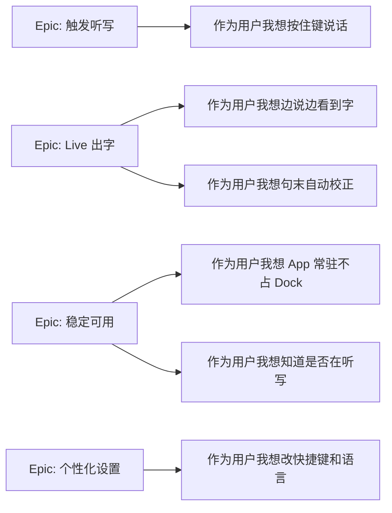
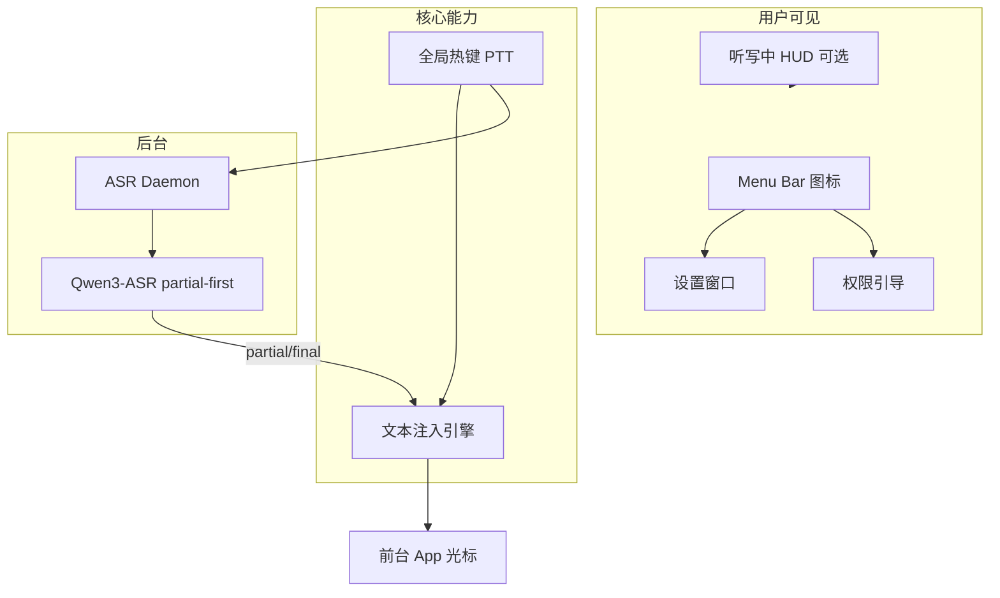
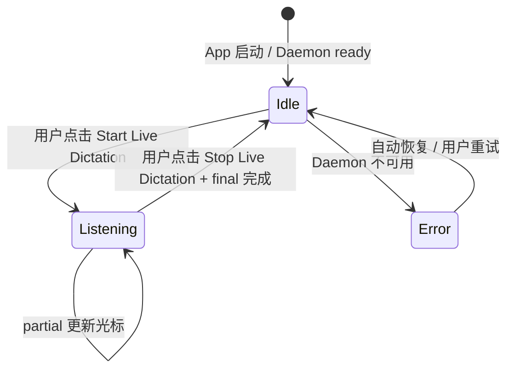
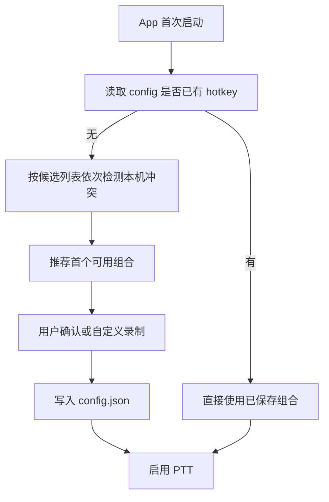
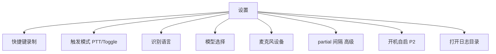
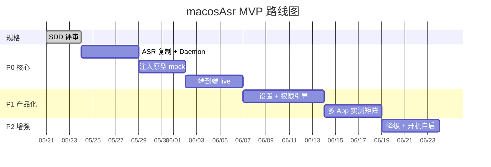
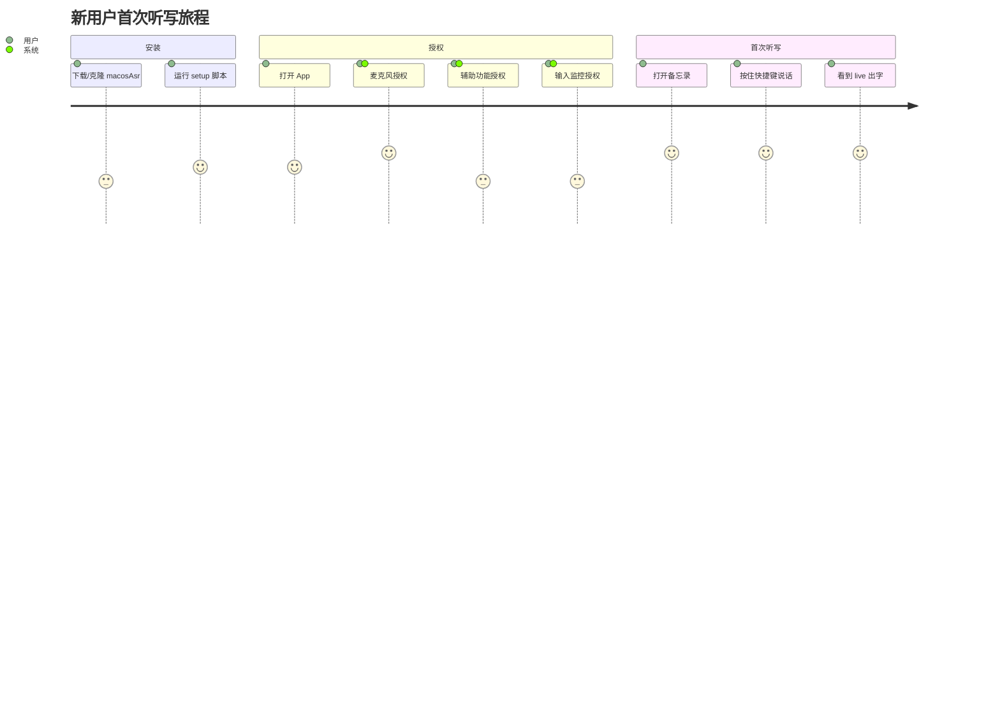

# 02 — PRD 产品需求文档

**产品名称**：macosAsr  
**版本**：Draft v0.1.2  
**日期**：2026-05-21  
**文档类型**：Product Requirements Document

---

## 1. 产品概述

### 1.1 一句话描述

**macosAsr** 是 Mac 上的本地语音听写工具：当前可直接试用的入口是菜单栏 **Start Live Dictation / Stop Live Dictation**；后续版本再引入按住快捷键说话，识别结果 **边说边出现在任意 App 的光标处**，无需云端、无需切换 App。

### 1.2 产品定位

| 维度 | 定位 |
|------|------|
| 品类 | 系统级语音输入 / 听写 |
| 对标体验 | iOS 听写 live 感、Wispr Flow 的「说哪写哪」 |
| 差异化 | **完全本地**（Qwen3-ASR + MLX），数据不出机 |
| 非目标 | 语音助手、AI 写作润色、会议转录 |

### 1.3 目标用户

- 需要在 **Cursor / IDE / 微信 / 备忘录** 等多场景快速输入文字的 Mac 用户
- 重视隐私，不愿使用云端听写
- 使用 Apple Silicon Mac（Mac mini M4 16GB 为产品验证基准机）

### 1.4 成功指标（MVP）

| 指标 | 目标 |
|------|------|
| 核心路径可用率 | 备忘录 + 1 个 IDE 中菜单触发 live 听写成功率 ≥ 95% |
| 首 partial 主观可感知 | 用户感觉「说完前半句就开始出字」 |
| 权限引导完成率 | 新用户 5 分钟内完成三项授权并完成首次听写 |
| 崩溃率 | Daemon + App 联合会话崩溃 < 1% |

---

## 2. 问题与机会

### 2.1 用户痛点

1. **打字慢**：长段中文输入效率低  
2. **云端听写隐私顾虑**：语音上传至第三方  
3. **现有本地方案少**：多数工具要么无 live 出字，要么只服务单一 App  
4. **macOS 原生听写**：依赖 Apple 服务，定制性弱

### 2.2 机会

- ASR-QWEN 已在 M4 上验证 Qwen3-ASR partial-first 路径  
- MLX 本地推理延迟可达 live 听写可用区间  
- 菜单栏 + 全局热键是 Mac 听写类产品的成熟交互范式

---

## 3. 用户故事

### 3.1 Epic 地图



### 3.2 用户故事明细

| ID | 故事 | 优先级 | 验收条件 |
|----|------|--------|----------|
| US-01 | 作为用户，我希望 **按住快捷键** 就能开始听写，松键结束 | P0 | PTT 在备忘录可用 |
| US-02 | 作为用户，我希望 **说话过程中** 文字出现在光标处 | P0 | partial 可见且随说话更新 |
| US-03 | 作为用户，我希望 **停顿或松键后** 得到更准确的 final 句 | P0 | final 替换 partial，语义更完整 |
| US-04 | 作为用户，我希望在 **微信 / IDE / 浏览器** 里也能用 | P0 | Tier A+B 实测通过 |
| US-05 | 作为用户，我希望 App **只在菜单栏**，不占 Dock | P1 | LSUIElement = true |
| US-06 | 作为用户，我希望 **图标变红** 表示正在听写 | P1 | 听写中状态可见 |
| US-07 | 作为用户，我希望 **自定义快捷键** 和 **中/英** 语言 | P1 | 设置页可改且持久化 |
| US-07a | 作为用户，我希望 **首次启动时** 确认听写快捷键，避免和我已有快捷键冲突 | P0 | 首次启动向导完成选键后才可 PTT |
| US-08 | 作为用户，我希望 **首次使用** 时被引导开权限 | P1 | 三步引导流程 |
| US-09 | 作为用户，当某 App 无法注入时，我收到 **明确提示** | P2 | 通知 + 文档 |

---

## 4. 功能规格

### 4.1 功能架构



### 4.2 交互设计

#### 4.2.1 主流程（当前版本：菜单栏 Start/Stop）



**Idle（空闲）**

- Menu Bar 图标：灰色麦克风
- 菜单栏：可响应 Start/Stop

**Listening（听写中）**

- Menu Bar 图标：红色麦克风
- 可选：屏幕顶部细条「正在听写，请勿编辑键盘」
- 用户说话 → partial live 写入光标
- 用户松键 → 强制 flush final → 回到 Idle

#### 4.2.2 快捷键行为

| 模式 | MVP | 行为 |
|------|-----|------|
| 菜单触发 | ✅ 当前版本 | 通过 Start Live Dictation / Stop Live Dictation 控制会话 |
| PTT | ❌ P1 | 按下开始 Session；松开结束并 flush |
| Toggle | ❌ P2 | 按一次开始，再按一次结束 |

**后续快捷键策略（当前版本不启用）**

若后续启用全局快捷键，规格 **推荐候选** 为 **`Fn + V` 按住（PTT）**，但当前版本不暴露该入口。

**Fn 键在 macOS 15 上的约束**

| 情况 | 影响 |
|------|------|
| 系统设置 → 键盘 →「按下 fn 键以」= **启动听写** | 与 **单按 Fn / Fn 双击** 冲突；若后续启用快捷键，向导须提示改为「无操作」或改选 `Fn + 字母` |
| 系统设置 = **显示表情与符号** / **切换输入法** | 单按 Fn 被占用；**`Fn + V` 等组合键通常不受影响** |
| `CGEventTap` 捕获 | 需输入监控；`Fn + 键` 比单 Fn 更稳定，后续快捷键方案可优先考虑 |

**候选列表**（仅供后续快捷键方案使用，在 **macOS 15.3.1** 开发机上实测；按优先级排序）：

| 优先级 | 候选 | 模式 | 说明 |
|--------|------|------|------|
| **1（推荐候选）** | **`Fn + V`** | PTT 按住 | V = Voice；与 Spotlight/输入法冲突面小；符合用户 Fn 偏好 |
| 2 | `Fn + D` | PTT 按住 | D = Dictation；备选 |
| 3 | `Fn` 双击 | Toggle（P1） | 类似部分听写 App；需单独实现双击检测，**不进 MVP 默认** |
| 4 | `Right Control` 按住 | PTT | Fn 不可用时 fallback |
| 5 | `⌃ + ⌥ + V` | PTT | 无 Fn 或 Fn 组合均冲突时 fallback |
| — | ~~单按 Fn 按住~~ | — | **不推荐**：易被系统 Globe/听写占用 |
| — | ~~`⌥ + Space`~~ | — | **不作为默认** |

**首次启动向导**

1. 如果后续启用快捷键，检测系统「按下 fn 键以」设置；若与所选组合冲突 → 说明 + 引导修改系统设置或换候选  
2. 后续默认展示 **`Fn + V`（按住说话）**；用户可 **确认或录制自定义**  
3. 写入 `config.json` 后启用 PTT  

**冲突参考**（非穷尽）：`⌘Space`、`⌃Space`、系统听写、`Raycast/Alfred` 用户热键 — 见 `docs/hotkey-conflicts.md`（实现阶段维护）。



#### 4.2.3 Live 出字体验规格

用户感知目标：**类似 iOS 听写**

| 阶段 | 用户看到 | 系统行为 |
|------|----------|----------|
| T0 | 点击 **Start Live Dictation**（或后续已配置的快捷键） | Session 开始，无文字 |
| T0+0.8~2s | 首词/首字出现 | 首个 partial 注入 |
| 说话中 | 文字随语音变长/修正 | 退格 pending + 新 partial |
| 停顿/松键 | 文字稳定为 final | final 替换 partial |
| 松键后 | 可继续打字 | Session 结束，pending 清零 |

**不应出现**：

- 同一位置重复堆叠 partial 而不替换  
- 松键后光标处留下半句 partial 无 final  
- 听写中用户按键导致退格删到用户自己的字（需 HUD 缓解）

### 4.3 识别体验

| 项 | 规格 |
|----|------|
| 引擎 | Qwen3-ASR（mlx-audio） |
| 路径 | partial-first（`stream_transcribe` + `generate`） |
| 默认模型 | `mlx-community/Qwen3-ASR-0.6B-8bit` |
| 可选模型 | `Qwen3-ASR-1.7B-8bit`（更准确、更慢） |
| 默认语言 | Chinese |
| 英文 | 设置切换 `English` |
| Filler 过滤 | 默认开启（嗯/啊等不注入） |
| 噪声校准 | Daemon 启动时 3s（用户保持安静） |

### 4.4 菜单栏 UI

| 状态 | 图标 | 菜单项 |
|------|------|--------|
| 未就绪 | 灰 + 警告点 | 打开权限引导 |
| 就绪 | 灰麦克风 | 设置… / 关于 / 退出 |
| 听写中 | 红麦克风 | （菜单可禁用或仅显示状态） |
| 错误 | 黄/红 | 重启 Daemon / 查看日志 |

### 4.5 设置页（P1）



---

## 5. 产品架构决策

### 5.1 已确认决策

| 决策 | 选择 | 理由 |
|------|------|------|
| Live 体验 | **A：边说边出字** | 用户明确选择 |
| App 范围 | **任意 macOS App** | 用户明确选择 |
| ASR 来源 | **复制 ASR-QWEN 并精简** | 自包含、可开源 |
| 复制策略 | **去掉报告/CLI 冗余** | Daemon 更干净 |
| 运行环境 | **全部在 macosAsr 内** | venv + 配置自包含 |
| 进程模型 | **Swift App + Python Daemon** | 各取所长 |
| MVP 触发 | **菜单 Start/Stop** | 与当前 README 一致，外部用户一眼可试用 |

### 5.2 竞品对比（简化）

| 能力 | macosAsr MVP | macOS 原生听写 | Wispr Flow |
|------|--------------|----------------|------------|
| 本地识别 | ✅ | 部分 | ❌ |
| Live 到光标 | ✅ 目标 | ✅ | ✅ |
| 任意 App | ✅ 目标 | ✅ | ✅ |
| 开源 | ✅ 计划 | ❌ | ❌ |
| 定制模型 | ✅ Qwen | ❌ | ❌ |

---

## 6. 版本规划

### 6.1 里程碑



### 6.2 版本定义

| 版本 | 名称 | 交付物 |
|------|------|--------|
| v0.1 | 规格 | SDD 三文档 + 评审 |
| v0.2 | P0 | Daemon IPC + 备忘录 live 听写 |
| v0.3 | P1 | 设置、权限、Tier A+B 矩阵 |
| v1.0 | 公开 | README + LICENSE + NOTICE，可给他人试用 |

### 6.3 MVP 范围边界

**Must Have**

- 菜单 Start/Stop、live partial、final、备忘录 + IDE  
- Menu Bar、基础权限引导  
- macosAsr 内 venv 与 ASR 代码

**Should Have**

- 设置页、多 App 文档、Daemon 自恢复

**Won't Have（v1.0 前）**

- Toggle、LLM 润色、词库、App Store、iCloud 同步

---

## 7. 权限与 Onboarding

### 7.1 权限清单

| 权限 | 用户文案（建议） | 用途 |
|------|------------------|------|
| 麦克风 | 「macosAsr 需要访问麦克风以进行本地语音识别」 | 采集语音 |
| 辅助功能 | 「macosAsr 需要辅助功能权限以将听写文字输入到光标处」 | 文本注入 |
| 输入监控 | 「macosAsr 需要输入监控权限以响应全局听写快捷键」 | 全局热键 |

### 7.2 Onboarding 流程



---

## 8. 异常与边界场景

| 场景 | 产品行为 |
|------|----------|
| Daemon 未启动 | Menu Bar 显示错误；提供「启动 Daemon」 |
| 模型下载中 | 显示进度；快捷键暂不可用 |
| 噪声校准中 | 提示「请保持安静 3 秒」 |
| 用户在听写中编辑键盘 | HUD 警告；可能发生退格误伤（已知限制） |
| 中文输入法拼音组合中 | 可能乱序；文档建议听写时使用直接输入模式 |
| 密码框焦点 | 不注入；可选提示 |
| 识别结果为空 | 不注入；无错误弹窗 |
| filler 被过滤 | 不注入；可选 debug 日志 |

---

## 9. 开源与合规（PRD 层）

| 项 | 要求 |
|----|------|
| 仓库 | macosAsr 独立开源 |
| NOTICE | 声明 ASR 核心逻辑来源于 ASR-QWEN，附 commit hash |
| LICENSE | macosAsr 项目主许可证待选定（MIT/Apache-2.0 等） |
| NOTICE | 仅注明 ASR 逻辑复制自 ASR-QWEN（**不要求**单独处理 ASR-QWEN LICENSE） |
| 分发 | MVP 为未签名本机 `.app`；文档说明 Gatekeeper 处理方式 |

---

## 10. 度量与反馈

| 阶段 | 收集方式 |
|------|----------|
| P0 | 开发日志：首 partial 延迟、final 延迟 |
| P1 | 手动矩阵：App × {成功/部分/失败} |
| 后续 | 可选匿名本地 metrics 文件（不上传） |

---

## 11. 附录：仓库目录（产品视角）

```
macosAsr/
├── docs/SDD/           # 规格文档（本目录）
├── asr/                # 自 ASR-QWEN 复制精简的识别库
├── asr_daemon/         # Python 常驻服务
├── MacApp/             # Swift 菜单栏应用（后续）
├── scripts/            # setup_venv 等
├── requirements.txt
├── LICENSE
├── NOTICE
└── README.md
```

---

## 12. 评审检查清单

评审人确认以下问题后再进入编码：

- [ ] Live partial + 任意 App 的目标是否与 SRS 一致  
- [ ] PTT 为 MVP 唯一模式是否接受  
- [ ] Tier A/B/C 兼容性预期是否接受  
- [ ] 中文 IME 已知限制是否接受  
- [ ] 开源 NOTICE 策略是否接受  
- [ ] 里程碑 P0→P1 顺序是否接受  

**评审结论**：□ 通过  □ 修改后再审  □ 驳回  

**签字 / 日期**：________________
