# 03 — 技术方案与架构设计

**项目名称**：macosAsr  
**版本**：Draft v0.1.2  
**日期**：2026-05-21  
**文档类型**：Technical Design Document（TDD）

---

## 1. 设计目标

1. 满足 SRS **FR-001 ~ FR-004**（PTT、live partial、final、Daemon 常驻）  
2. ASR 逻辑 **自包含** 于 macosAsr，自 ASR-QWEN **复制并精简**  
3. Swift 与 Python **进程隔离**，通过版本化 IPC 通信  
4. 注入层实现 **可测试的状态机**，与 ASR 解耦  

---

## 2. 总体架构

### 2.1 逻辑架构

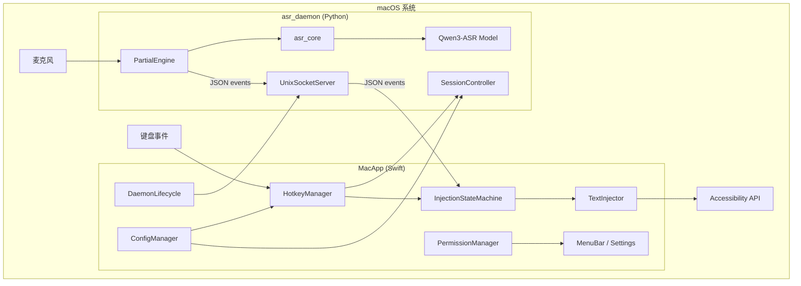

### 2.2 部署架构

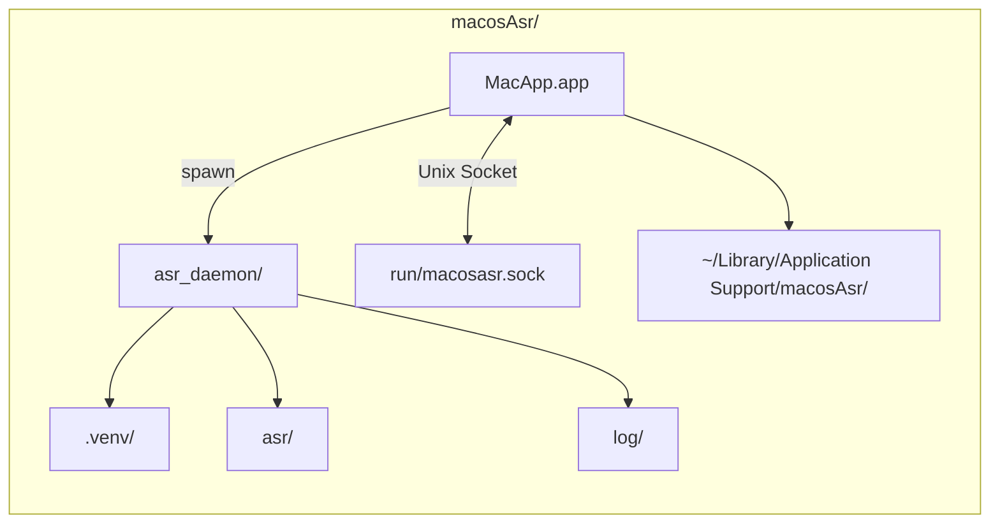

### 2.3 进程职责

| 进程 | 语言 | 职责 | 禁止 |
|------|------|------|------|
| MacApp | Swift | 热键、注入、UI、权限、Daemon 生命周期 | 加载 MLX / 采麦克风 |
| asr_daemon | Python | 模型、麦克风、VAD、partial/final | 直接操作光标 |

---

## 3. ASR 模块设计（复制自 ASR-QWEN）

### 3.1 复制范围

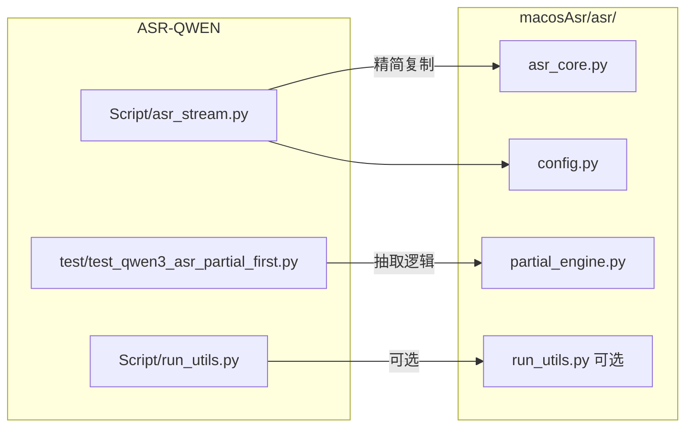

### 3.2 精简规则（相对 ASR-QWEN 原文件）

**保留（进入 `asr_core.py`）**：

- `AudioBlock`、常量、`FILLER_WORDS`
- `load_model`、`normalize_text`、`compact_text`、`should_drop_final_text`
- `audio_rms`、`stream_utterance_text`、`generate_utterance_text`
- `require_runtime_dependencies`、`list_devices`

**删除**：

- `parse_args` / CLI `main`
- `render_report`、`TranscriptRecord`、`default_output_report_path`
- `run_mic_mode`（preview 版）
- `transcribe_audio_file`（文件评测，v1 不需要）

**新建 `config.py`**：

- 用 `@dataclass AsrConfig` 替代 `argparse.Namespace`

**新建 `partial_engine.py`**：

- 自 `test_qwen3_asr_partial_first.py` 抽取 VAD 主循环
- 输出改为 **回调 / 事件队列**，不 `print`、不写 Markdown 报告

### 3.3 PartialEngine 内部结构

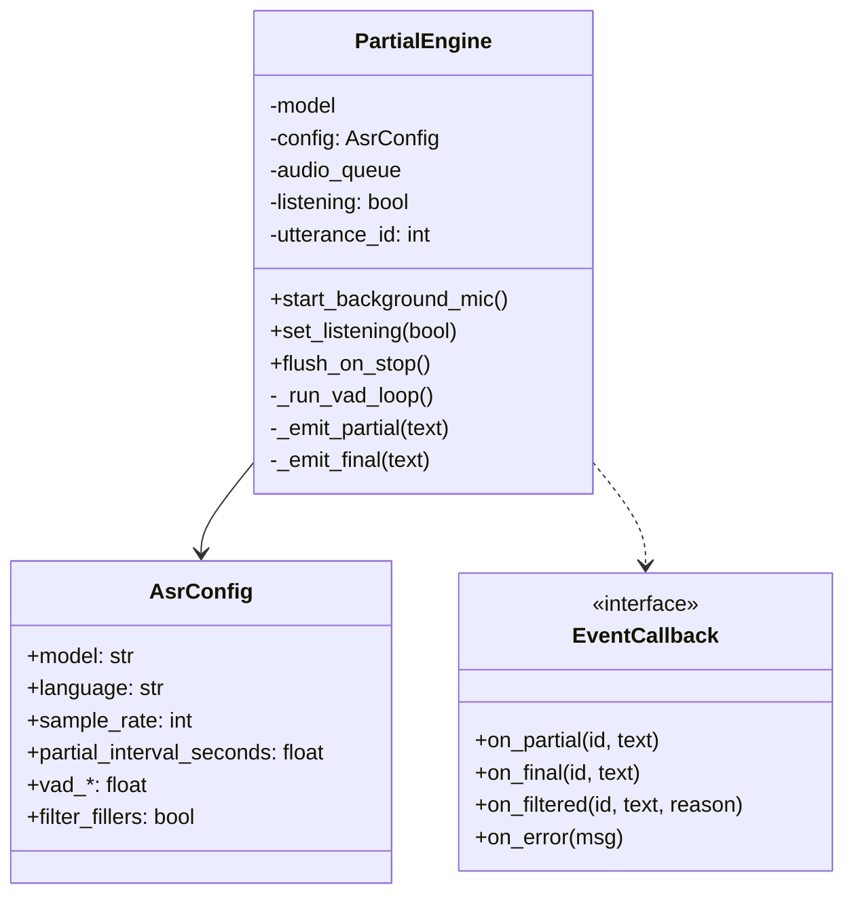

### 3.4 音频与 Session 策略

| 策略 | 选择 | 说明 |
|------|------|------|
| 麦克风 | Daemon 启动后 **常开** InputStream | 避免 PTT 时重启流带来的延迟 |
| 噪声校准 | Daemon 启动时执行 **一次** | 3s；Session 间复用 `active_threshold` |
| Session | `listening=true` 时才跑 VAD/ASR | 静音期仅采集不入队处理 |
| PTT 松键 | `session_stop` → **强制 flush** 当前 utterance | 即使 VAD 未断句 |

### 3.5 默认 ASR 参数

| 参数 | 值 | 来源 |
|------|-----|------|
| `partial_interval_seconds` | 0.25 | partial-first |
| `partial_min_audio_seconds` | 0.60 | partial-first |
| `vad_end_silence_seconds` | 0.30 | partial-first |
| `vad_start_speech_seconds` | 0.20 | partial-first |
| `vad_min_utterance_seconds` | 0.60 | partial-first |
| `noise_calibration_seconds` | 3.0 | 首次启动 |
| `model` | `Qwen3-ASR-0.6B-8bit` | 默认 |

---

## 4. MacApp 模块设计（Swift）

### 4.1 模块划分

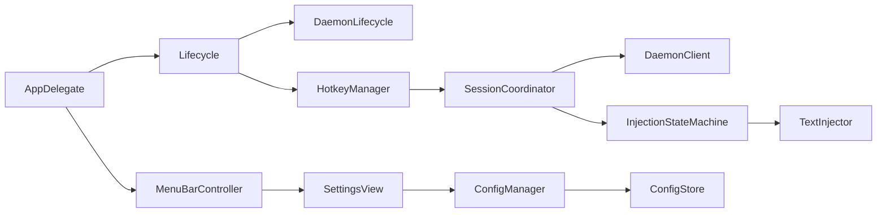

### 4.2 HotkeyManager

- 使用 `CGEventTap` 或 `MASShortcut` 类库（实现阶段选型）
- 需 **Input Monitoring** 权限
- PTT：`flagsChanged` / `keyDown` + `keyUp` 配对
- 防抖：同一 Session 不重复 `session_start`
- **默认推荐 `Fn + V` 按住（PTT）**；首次启动走 PRD §4.2.2 向导（检测系统 fn 设置冲突）
- 实现：`CGEventTap` 同时监听 `kVK_Function`（Globe/Fn）+ `kVK_ANSI_V` 的 keyDown/keyUp；二者均按下时 session_start，任一松开 session_stop
- **不推荐单 Fn 按住**：易被系统「按下 fn 键以 → 听写/表情」占用
- **Fn 双击**：P1 Toggle 备选，MVP 不实现
- 持久化至 `config.json`；fallback 顺序见 PRD 候选表

### 4.3 TextInjector

**优先级**：

1. **CGEventKeyboard** — 逐 Unicode 字符注入（主路径）  
2. **AXUIElement** — 对支持选区替换的控件作补充（可选 P1）  

**字符处理**：

- 中文：按 composed character 逐字发送  
- 退格：`kVK_Delete` 或 Unicode BACKSPACE  

### 4.4 注入状态机（核心）

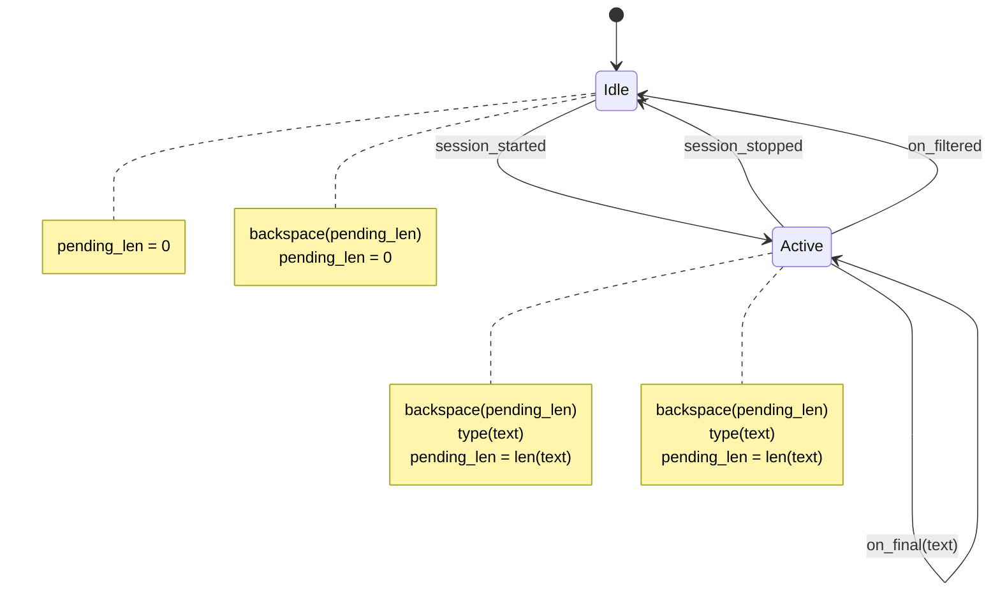

**伪代码**：

```
pending_len = 0

func onPartial(text: String) {
    backspace(count: pending_len)
    type(text: text)
    pending_len = text.count  // 按 grapheme cluster 计数
}

func onFinal(text: String) {
    onPartial(text: text)  // 同一替换逻辑
}

func onSessionStopped() {
    pending_len = 0
}

func onFiltered() {
    backspace(count: pending_len)
    pending_len = 0
}
```

**注意**：`String.count` 与视觉字符可能不一致；实现时用 `extendedGraphemeCluster` 对齐退格次数。

### 4.5 DaemonLifecycle

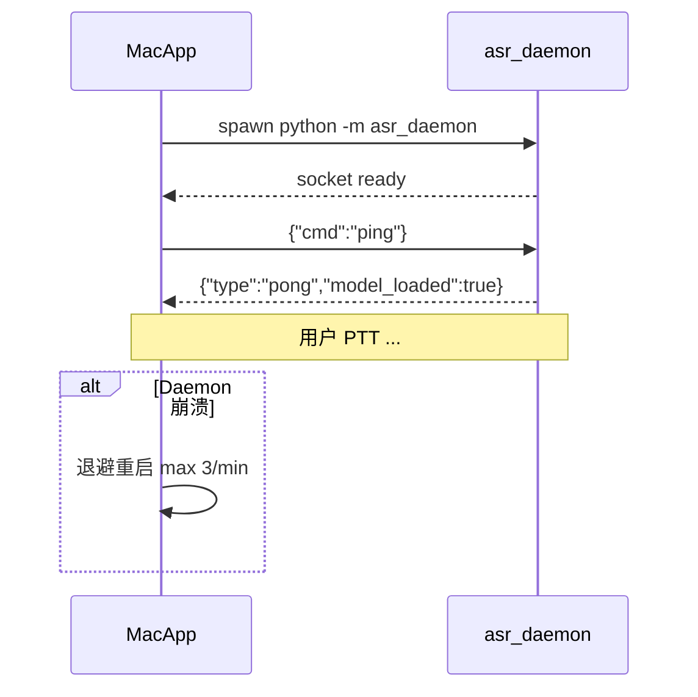

- Socket 路径：`$PROJECT/run/macosasr.sock` 或 Application Support 下  
- App 退出时发送 `shutdown`（可选 SIGTERM）

---

## 5. IPC 协议设计

### 5.1 传输

| 项 | 规格 |
|----|------|
| 传输 | Unix Domain Socket, stream |
| 帧格式 | **JSON Lines**（一行一条 JSON，`\n` 分隔） |
| 编码 | UTF-8 |
| 版本 | 首字段 `"protocol": 1` |

### 5.2 客户端 → Daemon（Command）

| cmd | 字段 | 说明 |
|-----|------|------|
| `ping` | — | 健康检查 |
| `session_start` | `language?` | 开始听写 Session |
| `session_stop` | — | 结束并 flush |
| `shutdown` | — | 关闭 Daemon |
| `get_status` | — | 模型/校准/ listening 状态 |

示例：

```json
{"protocol":1,"cmd":"session_start","language":"Chinese"}
```

### 5.3 Daemon → 客户端（Event）

| type | 字段 | 说明 |
|------|------|------|
| `pong` | `model_loaded`, `calibrated` | 响应 ping |
| `session_started` | `session_id` | Session 已开始 |
| `partial` | `session_id`, `utterance_id`, `text`, `ts` | 中间结果 |
| `final` | `session_id`, `utterance_id`, `text`, `ts` | 句末结果 |
| `filtered` | `utterance_id`, `text`, `reason` | 被过滤 |
| `session_stopped` | `session_id` | Session 结束 |
| `error` | `message`, `code?` | 错误 |
| `status` | `listening`, `model`, ...` | 响应 get_status |

示例：

```json
{"protocol":1,"type":"partial","session_id":"s1","utterance_id":1,"text":"你好世","ts":1710000000.12}
```

### 5.4 会话状态机（Daemon 侧）

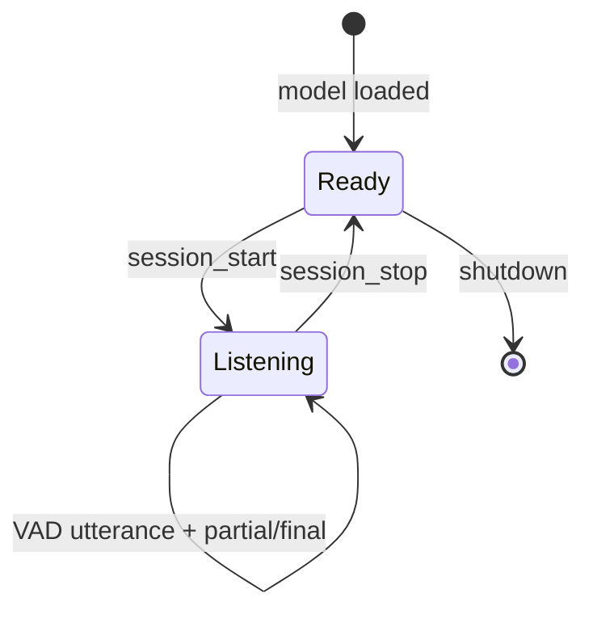

---

## 6. 配置与持久化

### 6.1 配置模型

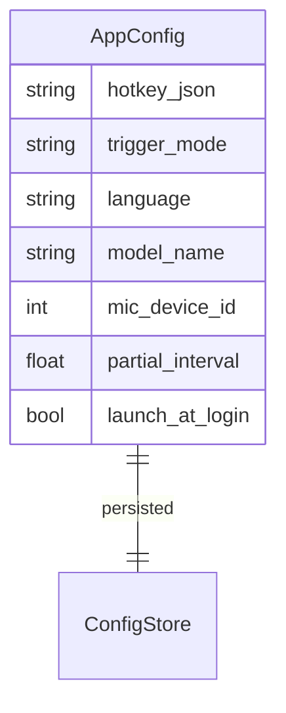

**存储路径**：

`~/Library/Application Support/macosAsr/config.json`

**Daemon 启动参数**（由 App 传入或读共享 config）：

- `--socket path`
- `--model`
- `--language`（Session 可覆盖）

---

## 7. 目录结构（实现基线）

```
macosAsr/
├── docs/SDD/                    # 规格文档
├── asr/
│   ├── __init__.py
│   ├── asr_core.py              # 精简自 asr_stream.py
│   ├── config.py                # AsrConfig
│   ├── partial_engine.py        # 精简自 partial_first
│   └── run_utils.py             # 可选日志
├── asr_daemon/
│   ├── __init__.py
│   ├── __main__.py
│   ├── server.py                # Unix socket + 协议
│   ├── session.py               # SessionController
│   └── cli_client.py            # P0 测试客户端
├── MacApp/                      # Swift Package / Xcode 工程
│   └── Sources/...
├── scripts/
│   └── setup_env.sh             # venv + pip + portaudio 提示
├── run/                         # socket 文件（gitignore）
├── log/                         # gitignore
├── requirements.txt
├── .gitignore
├── LICENSE
├── NOTICE                       # ASR-QWEN 来源说明
└── README.md
```

---

## 8. 依赖

### 8.1 Python（`requirements.txt`）

```
mlx
mlx-audio
numpy
sounddevice
```

系统依赖：`brew install portaudio`

### 8.2 Swift

- macOS SDK **15.0+**（开发与测试基准：**15.3.1 / Sequoia**）
- 无第三方依赖为 P0 目标；热键库可选

---

## 9. 安全设计

| 威胁 | 缓解 |
|------|------|
| 本地 Socket 被其他用户访问 | Socket 文件权限 `0600`；放在用户目录 |
| 日志泄露听写内容 | 默认日志不打 full transcript |
| 恶意 App 伪造注入 | 仅 MacApp 连接 Daemon；可选 token 握手 P2 |
| 注入到密码框 | 检测 Secure Event Input / 跳过 |

---

## 10. 测试策略

### 10.1 测试金字塔

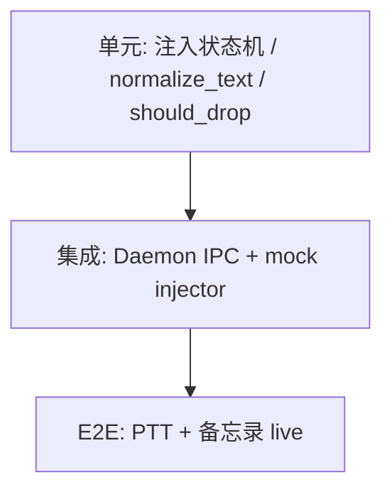

### 10.2 关键测试用例

| ID | 层 | 描述 |
|----|-----|------|
| T-01 | Unit | `pending_len` 退格重插：partial A→B→final C |
| T-02 | Integration | Daemon `session_start` 后 5s 内收到 ≥1 partial |
| T-03 | Integration | `session_stop` 必收到 final 或 filtered |
| T-04 | E2E | 备忘录 PTT 中文句 live + final |
| T-05 | E2E | IDE 注释听写 |
| T-06 | Manual | 微信 Tier C 记录结果 |

### 10.3 P0 验证命令（规格层，实现后执行）

```bash
# 环境
./scripts/setup_env.sh
source .venv/bin/activate

# Daemon
python -m asr_daemon

# 另一终端
python -m asr_daemon.cli_client --session-test
```

---

## 11. 可观测性

| 组件 | 日志位置 | 级别 |
|------|----------|------|
| asr_daemon | `log/daemon.log` | INFO；DEBUG 可选 |
| MacApp | Console.app + 可选文件 | OSLog |
| 指标 | P0 手动记录首 partial 延迟 | 开发 spreadsheet |

---

## 12. 开源与 NOTICE 模板

`NOTICE` 仅作来源致谢（**不追踪 ASR-QWEN LICENSE**）：

```text
macosAsr contains speech recognition logic derived from ASR-QWEN,
copied and modified on 2026-05-21.
Source files: asr/asr_core.py, asr/partial_engine.py (derived from
Script/asr_stream.py and test/test_qwen3_asr_partial_first.py).
```

macosAsr 仓库自身 `LICENSE` 在首次公开前选定即可。

---

## 13. 实现顺序（与 PRD 对齐）

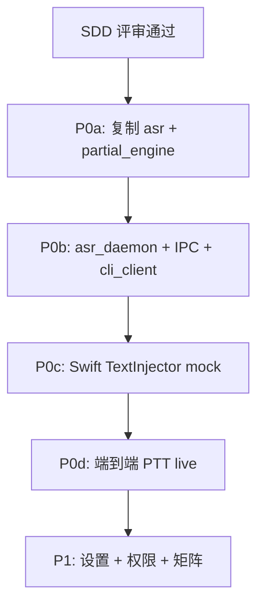

**硬门禁**：P0b 未通过（IPC partial/final）→ 禁止开始 Swift 注入联调。

---

## 14. 设计评审检查清单

- [ ] 双进程边界清晰，无 Swift 采麦克风  
- [ ] 注入状态机覆盖 partial/final/filtered/session_stop  
- [ ] IPC 协议含 `protocol` 版本字段  
- [ ] ASR 复制范围与精简规则与 SRS 一致  
- [ ] Socket 权限与路径在用户目录  
- [ ] NOTICE 模板就绪（来源致谢即可；不依赖 ASR-QWEN LICENSE）  
- [ ] P0 测试用例可执行  

**评审结论**：□ 通过  □ 修改后再审  

**签字 / 日期**：________________
