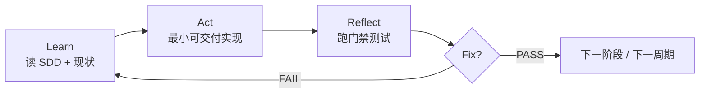

# LARF 多 Agent 开发工作流

> **LARF** = Learn → Act → Reflect → Fix  
> 每个阶段（P0a、P0b…）在 SDD 测试门禁内循环，直到 PASS 再进入下一阶段。

## 角色

| 角色 | 职责 | 典型产出 |
|------|------|----------|
| **Coordinator** | 读 SDD、拆阶段、更新 `PROGRESS.md`、派发 handoff | 阶段计划、门禁结论 |
| **Worker** | 按 handoff 实现最小可交付切片、跑测试 | 代码、`PROGRESS.md` Reflect 行 |

同一 Cursor 会话可交替扮演两角色；**进度与结论只写在 `docs/dev/`，不依赖对话记忆**。

## 单周期流程

### Learn

- 阅读 [`docs/SDD/`](../SDD/README.md) 相关章节（需求、TDD、门禁）
- 查看 `PROGRESS.md` 上一周期；Agent 归档见 `docs/dev/archive/AGENT_HANDOFF.md`
- 确认本阶段 **测试门禁**（见下表）

### Act

- 只实现当前阶段 **最小可交付** 范围（避免 Swift / P1 提前渗入）
- 运行时日志写入项目 [`log/`](../../log/)（见 [LOGGING.md](./LOGGING.md)）

### Reflect

- 执行 SDD / PROGRESS 中列出的命令
- 在 `PROGRESS.md` **LARF 历史表** 记录：日期、阶段、四步摘要、**PASS/FAIL**
- FAIL 时写清错误原文与复现命令

### Fix

- 针对 FAIL 根因修复后 **重新 Reflect**（新一行或同周期追加 Fix 说明）
- PASS 后更新 **Current phase** 与 **Next actions**

## 阶段与 SDD 测试门禁

| 阶段 | SDD 参考 | 门禁（必须通过） |
|------|----------|------------------|
| **P0a** | TDD §3、§7 | `asr/` 模块可导入；`partial_engine` 回调接口就绪 |
| **P0b** | TDD §5、§10.3 | `python -m asr_daemon` + `cli_client --ping`；`--session-test` 收到 partial/final JSON |
| **P0c** | TDD §4 | Swift 注入 mock（退格重插） |
| **P0d** | SRS §8.1 | 端到端 PTT + 备忘录 live |
| **P1+** | PRD / SRS §8.2 | 设置、权限、矩阵等 |

**硬门禁**（TDD §13）：P0b IPC 未 PASS → 禁止 Swift 注入联调。

## Agent 如何记录 LARF

每个 Worker 周期结束时更新：

1. [`PROGRESS.md`](./PROGRESS.md) — 历史表一行 + Current phase
2. 可选 [`archive/AGENT_HANDOFF.md`](./archive/AGENT_HANDOFF.md) — 交给下一 Agent（模板在归档内）
3. 若改日志约定 — [`LOGGING.md`](./LOGGING.md)

**Learn/Act/Reflect/Fix 列示例**（中文一行摘要即可）：

| 列 | 示例 |
|----|------|
| Learn | 读 TDD §3.2 精简规则；确认 P0a 不含 daemon |
| Act | 复制 asr_core + partial_engine + config |
| Reflect | `python -m asr_daemon --help` → exit 0 |
| Fix | 无 / 补 PYTHONPATH 文档 |

## 相关文档

- [PROGRESS.md](./PROGRESS.md) — 活进度日志
- [archive/AGENT_HANDOFF.md](./archive/AGENT_HANDOFF.md) — Agent 交接（已归档）
- [LOGGING.md](./LOGGING.md) — `log/` 目录约定
- [SDD 索引](../SDD/README.md)
